**PLUTUS PIONEER PROGRAM**

**Documentation Week 1**

**Creator: Kappos Angelos**

**Credits to: Sapiopool**

**Contents**

- **(E)UTxO Model**
- When Is Spending Allowed?
- Script Context
- Cardano approach
    - Cardano approach has a lot of advantages compared to the Ethereum model
- On Chain Code
- Off chain Code
- Install **Windows Subsystem Linux** (Windows users) – WSL2
- Install **Cabal** toWSL2
- Install **Nix** to WSL2
- Creation of /etc/nix folder
- Set up **IOHK binary caches**
- **Clone** the The Plutus repository, check out the correct commit as specified **in cabal.project**.
- Enter a **nix-shell**.
- Folder **plutus-playground-client.**
- Start with playground **server** with **plutus-playground-server**.
- Start with Playground **client** in another **nix-shell, with npm run start**.
- Copy-paste the auction contract into the Playground editor from github of IOHK
- Results
- Social Media Links

**The (E)UTxO Model**

**Overview**

One of the most important things you need to understand in order to write Plutus smart contracts is the accounting model that Cardano uses, **the Extended Unspent Transaction Output model.**

The **UTxO model** , without the (E) is the one that was introduced by Bitcoin, but there are other models.

Ethereum for example, uses the so-called **account-based model** , which is what you are used to from normal banking, where everybody has an account, each account has a balance and if you transfer money from one account to another then the balances get updated accordingly.

**That is not how the UTxO model works.**

**Unspent transaction outputs UTxO** are exactly what the name says.

- They are transaction outputs from previous transactions that have happened on the blockchain that have not yet been spent.
- A transaction is something that contains an arbitrary number of inputs and an arbitrary number of outputs.
- The effect of a transaction is to consume inputs and produce new outputs.

**The important thing is that you can only ever use complete UTxOs as input.** Alice cannot simply split her existing 100 ADA into a 90 and a 10, she has to use the full 100 ADA as the input to a transaction.Once consumed by the transaction, Alice&#39;s input is no longer a UTxO (an unspent transaction). It will have been spent as an input to Tx 1. So, she needs to create outputs for her transaction.

She wants to pay 10 ADA to Bob, so one output will be 10 ADA (to Bob). She then wants her change back, so she creates a second output of 90 ADA (to herself).

The full UTxO of 100 ADA has been spent, with Bob receiving a new transaction of 10 ADA, and Alice receiving the change of 90 ADA.

In any transaction, **the sum of the output values must match the sum of the input values**. Although, strictly speaking, this is not true. **There are two exceptions.**

1. Transaction fees. In a real blockchain, you have to pay fees for each transactions.
2. Native Tokens. It&#39;s possible for transactions to create new tokens, or to burn tokens, in which case the inputs will be lower or higher than the outputs, depending on the scenario.

**When Is Spending Allowed?**

The way it works is by adding signatures to transactions.

- In transaction 1, Alice&#39;s signature has to be added to the transaction.
- In transaction 2, both Alice and Bob need to sign the transaction.

Everything explained so far is just about the UTxO model, not the (E)UTxO model.

The extended part comes in when we talk about smart contracts, so in order to understand that, let&#39;s concentrate on the consumption of Alice&#39;s UTxO of 100 ADA.

**In the UTxO model,**** the validation **that decides whether the transaction that this input belongs to is allowed to consume the UTxO,** relies on digital signatures**.

In this case, that means that Alice has to sign the transaction in order for the consumption of the UTxO to be valid.

**The idea of the (E)UTxO model is to make this more general.**

Instead of having just one condition, namely that the appropriate signature is present in the transaction, we replace this with arbitrary logic.

This is where Plutus comes in.

Instead of just having an address that corresponds to a public key that can be verified by a signature that is added to the transaction, we have more general addresses, not based on public keys or the hashes of public keys, but instead contain arbitrary logic which decides under which conditions a particular UTxO can be spent by a particular transaction.

So, instead of an input being validated simply by its public key,

- the input will justify that it is allowed to consume this output with
- some arbitrary piece of data that we call the _ **Redeemer** _.

- We replace the public key address (Alice&#39;s in our example), with a **script** , and
- we replace the digital signature with a _ **Redeemer** _.

What exactly does that mean? What do we mean by _arbitrary logic_?

It is important to consider the context that the script has. There are several options.

**Script Context**

**The Cardano approach**

In Plutus,

- the script cannot see the whole blockchain, but it can see the whole transaction that is being validated.
- In contrast to Bitcoin, it can&#39;t see only the redeemer of the one input, but it can also see all the inputs and outputs of the transaction, and the transaction itself.

The Plutus script can use this information to decide whether it is ok to consume the output.
There is one last ingredient that Plutus scripts need in order to be as powerful and expressive as Ethereum scripts.

- That is the so-called **Datum**. That is a piece of data that can be associated with a **UTxO** along with the **UTxO value**.

With this it is possible to prove mathematically that Plutus is at least as powerful as the Ethereum model - any logic you can express in Ethereum you can also it can express using the (E)UTxO model.

**Cardano approach has a lot of advantages compared to the Ethereum model.**

For example, in Plutus,
- it is possible to check whether a transaction will validate in your wallet, before you ever send it to the chain.
- Things can still go wrong with off-chain validation, however.
    - For example in the situation where you submit a transaction that has been validated in the wallet but gets rejected when it attempts to consume an output on-chain that has already been consumed by another transaction. **In this case, your transaction will fail without you having to pay any fees.**
    - But if all the inputs are still there that your transaction expects, then you can be sure that the transaction will validate and will have the predicted effect.
    - **This is not the case with Ethereum.** In Ethereum, the time between you constructing a transaction and it being incorporated into the blockchain, a lot of stuff can happen concurrently, and that is unpredictable and can have unpredictable effects on what will happen when your script finally executes.

- In Ethereum it is always possible that **you have to pay gas fees for a transaction even if the transaction eventually fails with an error**. And that is guaranteed to never happen with Cardano.

- In addition to that, it is also easier to analyse a Plutus script and **to check, or even prove, that it is secure** , because you don&#39;t have to consider the whole state of the blockchain, which is unknowable.
    - You can concentrate on this context that just consists of the spending transaction.
    - So you have a much more limited scope and that makes it much easier to understand what a script is actually doing and what can possibly go wrong.

**Who is responsible for providing the datum, redeemer and the validator?**

- The rule in Plutus is that **the spending transaction has to do that** whereas the producing transaction only has to provide hashes.
    - That means that if I produce an output that sits at a script address then this producing transaction only **has to include**** the hash of the script and the hash of the datum that belongs to the output**.
    - Optionally it can include the datum and the script as well.
- If a transaction wants to consume such an output then _that_  transaction has to provide the datum, the redeemer and the script.
    - Which means that in order to spend a given input, you need to know the datum, because only the hash is publicly visible on the blockchain.

This is sometimes a problem and not what you want and **that&#39;s why you have the option to include the datum in the producing transaction**.

If this were not possible, only people that knew the datum by some means other than looking at the blockchain would ever be able to spend such an output.

**The (E)UTxO model is not tied to a particular programming language**. What we have is Plutus, which is Haskell, but in principal you could use the same model with a completely different programming language, and we intend to write compilers for other programming languages to Plutus Script which is the &quot;assembly&quot; language underlying Plutus.

**On-chain and Off-chain code**

The important thing to realise about Plutus is that there is on-chain and off-chain code.

**On-chain**

On-chain code is

- the scripts from the UTxO model.
- In addition to public key addresses we have script address and outputs can sit at such an address, and if a transaction tries to consume such an output, the script is executed, and the transaction is only valid if the script succeeds.
- If a node receives a new transaction, it validates it before accepting it into its mempool and eventually into a block. For each input of the transaction, if that input happens to be a script address, the corresponding script is executed. If the script does not succeed, the transaction is invalid.

**The task of a script is to say yes or no to whether a transaction can consume an output**.

**Off-chain**

- In order to unlock a UTxO, you must be able to construct a transaction that will pass validation and that is the responsibility of the off-chain part of Plutus.
- This is the part that runs on the wallet and not on the blockchain and will construct suitable transactions.

**Windows Plutus Setup with**  **WSL2**  **and****  ****Νix**

1. **Installation of Windows Subsystem Linux 2:**

- [https://docs.microsoft.com/en-us/wind...](https://www.youtube.com/redirect?event=video_description&amp;redir_token=QUFFLUhqbWFLQnN0NThmZHYya3NPWmFvWjhTaE5iRURhQXxBQ3Jtc0tuNDQ4OUNycGQ5YWRMM2RjN3VzNk0zS0pRU2RpclZGUlNwNTNudWpVaVFGbExtcE5rUVE1cUZ5ek90YkRUT01ZMEFtNmV0b3ViWlNqamlpeHcyWlE5alBWRGl0cmstUGFxdjVvNUY1TThNVFN3TnFiUQ&amp;q=https%3A%2F%2Fdocs.microsoft.com%2Fen-us%2Fwindows%2Fwsl%2Finstall-win10)

- Follow the above documentation if you are a Windows User. It&#39;s one way where you can set up Plutus Playground. Otherwise, you can use Virtual Box or to set up Ubuntu on your Windows. I suggest this solution it will take some steps but it&#39;s faster at the end. When installation of WSL is ready,
- Download from Microsoft Store the Linux Distribution of your choice/
- When everything is set up, you need to set as a default Ubuntu (the version that you have downloaded)

```
wsl --set-default Ubuntu-20.04 
wsl --list
```


With the above commands you can to set WSL 2 as the default version when installing a new Linux distribution:

- Install and set up Windows Terminal (it helps)
- Open a Windows Terminal for Ubuntu(wsl2) and press this command:

```powershell
sudo apt-get update
```

If you have any issue or Fetching errors with the above command probably you need to run the below command first:

```powershell
echo "nameserver 8.8.8.8" | sudo tee /etc/resolv.conf > /dev/null
```

**Cabal Installation:**

```powershell
sudo apt install cabal-install
cabal --version
```

And check the version of it to be sure about the installation.

**Nix**  **Installation**** :**

[https://nixos.org/download.html](https://www.youtube.com/redirect?event=video_description&amp;redir_token=QUFFLUhqbC11Tm9scTZ3eU9VbHNoQnlKR193SEp5cnZ0d3xBQ3Jtc0tuNUdUOHdmTnctcm1iUUFDVXpyUzZ0aDVxeDNNcm1haHFNdENMLXRMZlczdGFRekJEQWVXR3IwQ21rVVJyNDQ1ZHJ0RnJLMTZZVXktSjlCeHZNYVl5V0dPQzFVNk1jQW96dEFVeUNyRlR4cGY2Z0ZUdw&amp;q=https%3A%2F%2Fnixos.org%2Fdownload.html)

```powershell
curl -L https://nixos.org/nix/install | sh
nix --version
```

And check the version of it to be sure about the installation.

**Creation of /etc/nix directory if it doesn&#39;t exist:**

```powershell
mkdir -p /etc/nix
```

**Set up IOHK binary caches**  **-prerequisite for Plutus Playground-**

Adding the IOHK binary cache to your Nix configuration will speed up builds a lot, since many things will have been built already by our CI.

If you find you are building packages that are not defined in this repository, or if the build seems to take a very long time then you may not have this set up properly.

To set up the cache:

**Create file nix.conf inside directory /etc/nix/ and add the following:**

```powershell
sudo vim /etc/nix/nix.conf
```
Where you need to add:
```powershell
sandbox = false 
use-sqlite-wal = false 
substituters = https://hydra.iohk.io https://iohk.cachix.org https://cache.nixos.org/ 
trusted-public-keys = hydra.iohk.io:f/Ea+s+dFdN+3Y/G+FDgSq+a5NEWhJGzdjvKNGv0/EQ= iohk.cachix.org-1:DpRUyj7h7V830dp/i6Nti+NEO2/nhblbov/8MW7Rqoo= cache.nixos.org-1:6NCHdD59X431o0gWypbMrAURkbJ16ZPMQFGspcDShjY=
```
Confirm that you have set up correctly IOHK binary caches by doing this command:
```powershell
cat /etc/nix/nix.conf
```


**Clone the The Plutus repository, check out the correct commit as specified in cabal.project**  **Plutus Repo:**

[https://github.com/input-output-hk/pl...](https://www.youtube.com/redirect?event=video_description&amp;redir_token=QUFFLUhqbUdkTjB6V2FBMlJVU2gxRWlJNU9TdjVka1NtUXxBQ3Jtc0trak5paTVYbHk1RUotRjlTeGY4TGFDSU8xTUJjcl9nTWRsN215ZG9WOElDNnY1SkJqYzRPNXMxOHo5WUs5dDdHYXc0dWdrQVBFTkRLZEV0MjRRTzFneURRWWwtazZxNGwtSjREckx0SXR3NTl5c1pTcw&amp;q=https%3A%2F%2Fgithub.com%2Finput-output-hk%2Fplutus)

**Plutus Pioneer Program Repo:**

[https://github.com/input-output-hk/pl...](https://www.youtube.com/redirect?event=video_description&amp;redir_token=QUFFLUhqbEtHWkdrYTRoWTRvSzJoZW1JbVBvaHZBT2ZrQXxBQ3Jtc0tsTmN5eWluekFCVTN2dlhlMHpONnhyUy10TXYwNmJIRE1CU3IzUHl3WWxQcmtvRlBpQTFyQkhqU1diS292Z1FTeTZyYk1KZ21DQ1cyaUsydmprSUhuaHdMZVIxaFBaNkxNV1BXajFPb2t0MVVSUGRfWQ&amp;q=https%3A%2F%2Fgithub.com%2Finput-output-hk%2Fplutus-pioneer-program)

Create a folder of **Plutus** , and follow these commands:

```powershell
mkdir plutus
cd plutus
git clone https://github.com/input-output-hk/plutus.git
cd plutus
git checkout ea0ca4e9f9821a9dbfc5255fa0f42b6f2b3887c4
git branch 
```
With the last command you will see the detached HEAD branch.

This tag specifically matches to the branch of plutus that we want to run the local server.

**In this plutus branch where you are:**

**Install Nix-shell**

```powershell
nix-shell 
```

The installation will take more or less 30 minutes, depending on your environment. Take a cookie and when installation is completed you will see something like this at the end, which means nix-shell is installed successfully, you have enter a nix-shell.

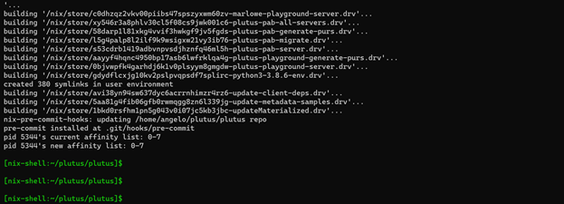

You can rerun this command and you will see that this will take less than a minute this time.

 In the same directory plutus:

**Set up Plutus playground:**

```powershell
nix-build -A plutus-playground.client
nix-build -A plutus-playground.server
```

We continue by following the below commands. We need to build some dependencies before we start the local server:

```powershell
nix-build -A plutus-playground.generate-purescript 
nix-build -A plutus-playground.start-backend 
nix-build -A plutus-pab
```
For your information, to run the playground maybe these commands are not required.

**!!We need to be always in a nix-shell**

**nix-shell**

We follow then these commands:

```powershell
cd plutus/plutus/
cd plutus-pab 
plutus-pab-generate-purs 
cd ../plutus-playground-server 
plutus-playground-generate-purs
cd plutus-playgorund-server
plutus-playgorund-server
```
At this moment we need to see something like this:

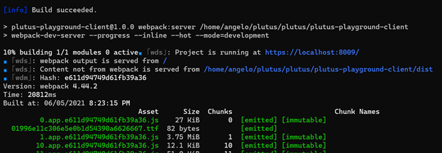

**Next step is to set up our Plutus-Client:**

But first we need to be sure that we have already installed node &amp;&amp; npm:

```powershell
node --version 
sudo apt install node
node –-version
sudo apt install npm

cd plutus 
nix-shell 
cd plutus-playground-client 
npm run start
```


**Voila! Plutus plauground!**

[https://localhost:8009/](https://localhost:8009/)

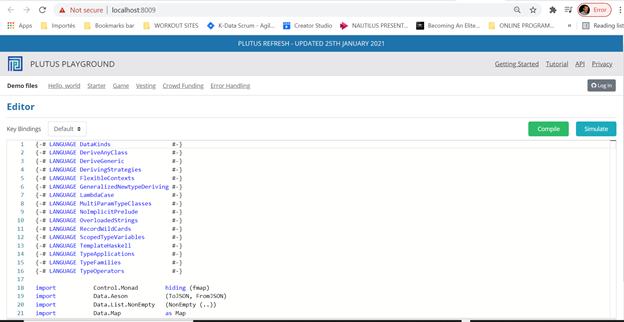

**PLUTUS SERVER-CLIENT READY:**

[https://localhost:8009](https://localhost:8009/)

Simulation of different auction scenarios for #week1 of Plutus-Pioneer-Program:

1. Copy and paste the code from the directory ofplutus-pioneer-program/code/week01/src/Week01/EnglishAuction.hs
2. Remove the below lines:

```python
module Week01.EnglishAuction
    ( Auction (..)
    , StartParams (..), BidParams (..), CloseParams (..)
    , AuctionSchema
    , start, bid, close
    , endpoints
    , schemas
    , ensureKnownCurrencies
    , printJson
    , printSchemas
    , registeredKnownCurrencies
    , stage
    ) where
```


1. Press «Compile» button
2. Press «Simulate» button

Here you can do different scenarios based of the smart contract which is written. Below you will see the simulation of the example that is explained during the lecture with its transactions. Let&#39;s have some fun.

**Some things you need to know for this scenario** :

The reason of the creation of this contract is the auction of a NFT. The default option for each wallet are 10 Lovelaces, and 10 tokens. As we know for NFTs, we can&#39;t really have here more than one tokens. So, we change the default values based on our scenario.

Our purpose here is to have a NFT, to create the auction between 3 wallets, the one has the token, and two other which wants to bid for this NFT. The wallet who bids the most wins. That&#39;s it.

Wallet 1 starts the auction and it closes the auction when the transaction has completed successfully.

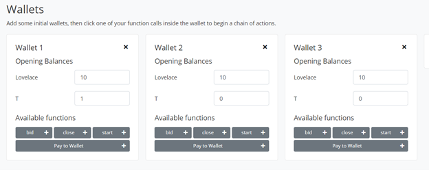

Press &quot;Start&quot; button from Wallet 1 to begin the auction and we put the below values to the wallets in order to see in practice how the contract will work.

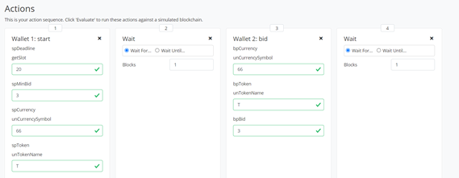

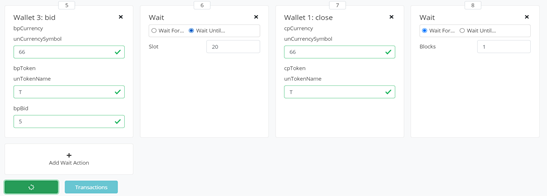

At the end we click to &quot;Evaluate&quot; button , the green one, and we expect to see the below transactions:

**What do we see here?**

- **Slot 0, Tx 0,**  **Creation of genesis block**

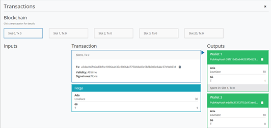

- **Slot 1, Tx 0,**  **Token, passes to the contract**

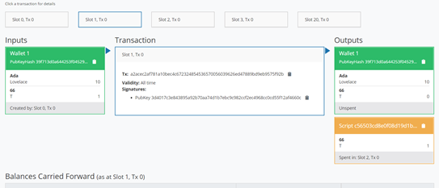

- **Slot 2, Tx 0, Wallet 2 bids 3 Lovelaces for the auction****.**

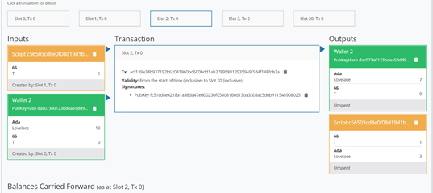

- **Slot 3, Tx 0,**  **Wallet 3 bids 5 lovelaces.**

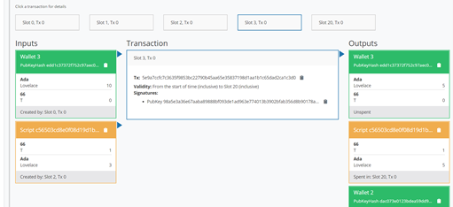

- **Slot 20, Tx 0,**  **Wallet 3 wins the auction, it takes the Token and contract returns the 3 lovelaces to Wallet 2.**

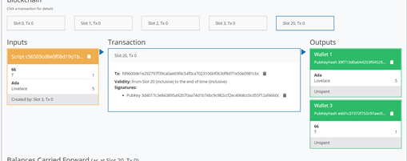

**Results: The result of the contract is shown below. Wallet 3 has the Token now.**

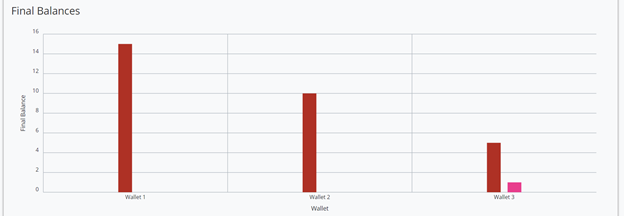

The official lecture can be found here [https://www.youtube.com/watch?v=IEn6jUo-0vU&amp;feature=youtu.be&amp;ab\_channel=LarsBr%C3%BCnjes](https://www.youtube.com/watch?v=IEn6jUo-0vU&amp;feature=youtu.be&amp;ab_channel=LarsBr%C3%BCnjes) of Lars Brünjes on YouTube.

The above documentation is created from Angelos Dionysios Kappos for personal use and in order to share it with Cardano community for educational purposes and everybody who is interested to learn the smart contracts of Cardano, and not to be sold.


**Social Media Links Links/ More information:**

**Linkedin** : [https://www.linkedin.com/in/angelos-dionysios-kappos-4b668140/](https://www.linkedin.com/in/angelos-dionysios-kappos-4b668140/)

**Who is SapioPool Cardano Community** : [https://sapiopool.com/](https://sapiopool.com/)

**Participate in Discord channel here** : [https://discord.com/invite/HRK9gGE9ax](https://discord.com/invite/HRK9gGE9ax)

**Twitter accounts:**

- [https://twitter.com/angelokappos](https://twitter.com/angelokappos)

- [https://twitter.com/sapiopool](https://twitter.com/sapiopool)

**Sapiopool Youtube** :
- [https://www.youtube.com/channel/UCcPH2RMsszRGJ2awvLdMKzQ](https://www.youtube.com/channel/UCcPH2RMsszRGJ2awvLdMKzQ)
